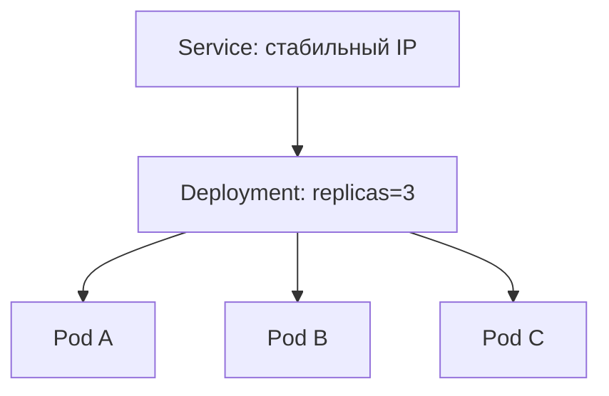

---
title: Kubernetes — pod, deployment, service
tags: [kubernetes, k8s, devops, containers]
parent: [[00 Индекс всех тем]]
prev: [[Dockerfile и слои образа]]

# ☸️ Kubernetes: pod, deployment, service

## 🧠 Ментальная модель

| Компонент | Аналогия | Что делает |
|-----------|----------|-----------|
| **Pod** | 👷 Рабочая бригада | 1+ контейнеров, делят сеть |
| **Deployment** | 👔 Диспетчер бригад | Управляет копиями, обновлениями |
| **Service** | 🚪 Ресепшн / Постоянный адрес | Стабильный IP для pod'ов |

## 🏗️ Схема

## 📋 Кратко

|Компонент|Обязателен?|Зачем|
|---|---|---|
|Pod|✅|Минимальная единица|
|Deployment|✅ (для production)|Масштабирование, rolling update|
|Service|✅|Чтобы pod'ы не терялись|

## 🔗 Связано

- [[Docker vs VM]]
    
- [[Dockerfile и слои образа]]