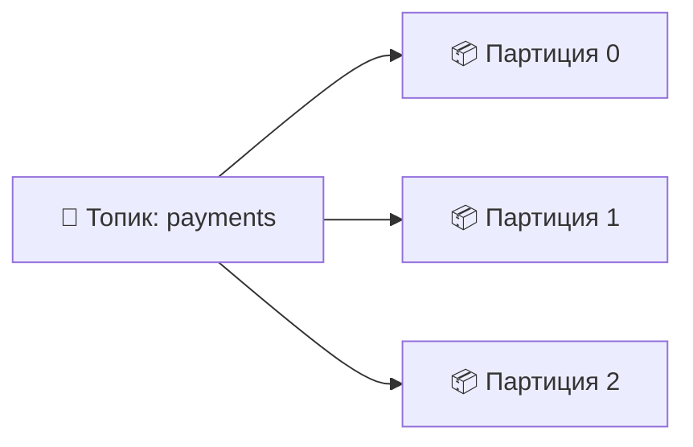
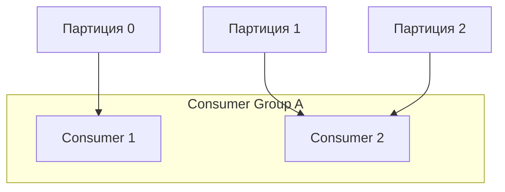
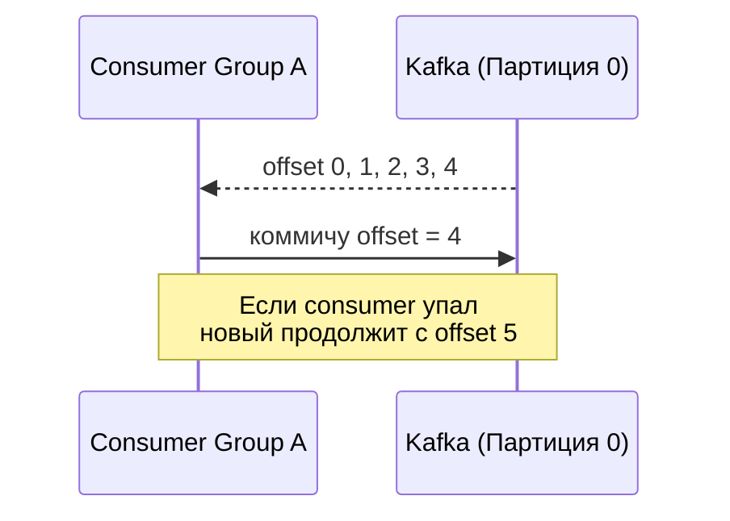

# 📬 Apache Kafka: топики, партиции, офсеты, брокеры, consumer group

> [!note] Метод обучения
> Заметка построена по принципам **Джастина Сонга**:
> - аналогии и простые слова
> - связи с уже известными концепциями
> - высшие уровни мышления (анализ, оценка)

---

## 🧠 Ментальная модель (аналогия)

**Kafka = супер-почтовая служба для предприятий**

| Термин Kafka | Аналогия |
|--------------|---------|
| **Топик (Topic)** | Улица / почтовый адрес |
| **Партиция (Partition)** | Почтовый ящик на улице |
| **Брокер (Broker)** | Почтовое отделение (здание) |
| **Офсет (Offset)** | Номер на письме (1, 2, 3...) |
| **Consumer Group** | Группа курьеров, разбирающих ящики |
| **Кластер (Cluster)** | Сеть почтовых отделений |

> [!important] Ключевое правило
> **Одно письмо из одного ящика забирает только один курьер из одной группы.**

---

## 🏛️ Архитектура: от общего к частному

### 1. Топик (Topic)
- Логическая категория / канал данных
- Пример: `payments`, `user-events`, `logs`

### 2. Партиция (Partition)
- Топик физически делится на **партиции**
- Каждая партиция — **неизменяемый упорядоченный лог**


### 3. Офсет (Offset)

- Уникальный **индекс** сообщения **внутри** партиции
    
- Начинается с 0
    
- Kafka **не удаляет** сообщения после прочтения
    


```text
Партиция 0:
[offset:0] — {user: alice, amount: 100}
[offset:1] — {user: bob, amount: 250}
[offset:2] — {user: alice, amount: 50}
```
### 4. Брокер (Broker)

- Сервер (нода) в кластере Kafka
    
- Хранит **несколько партиций** (разных топиков)
    

### 5. Consumer Group

- Группа потребителей, работающих вместе
    
- **Каждая партиция читается только одним consumer’ом внутри группы**

> [!tip] Масштабирование  
> Чтобы увеличить скорость обработки:
> 
> - увеличьте **количество партиций**
>     
> - добавьте **consumer’ов** в группу (но не больше, чем партиций)
>     

---

## 🔗 Связи с уже известными концепциями

|Kafka|Аналогия / Связь|
|---|---|
|**Offset**|Индекс в массиве (`arr[0]`, `arr[1]`)|
|**Broker**|Нода в кластере (как в Redis, Cassandra)|
|**Replication**|RAID 1 / репликация в БД|
|**Consumer Group**|Группа воркеров, делящих очередь (RabbitMQ)|
|**Partition**|Shard / шард в базе данных|

---

## 🧩 Почему архитектура именно такая?

### ❓ Почему офсет уникален только внутри партиции?

- Если бы офсет был глобальным → нужна была бы глобальная блокировка → **снижение производительности**
    
- Партиции позволяют **параллельную запись**
    

### ❓ Почему партиция читается только одним consumer’ом в группе?

- Иначе будет **дублирование** обработки
    
- Либо сложная координация (кто какой офсет обрабатывает)
    
- Kafka выбирает **простоту и предсказуемость**
    

### ❓ Почему Kafka быстрая?

- **Sequential I/O** — запись в конец файла (как в лог)
    
- **Zero-copy** — передача данных без копирования между буферами
    
- Хранение на диске, но работа с памятью (page cache)
    

---

## 🔁 Consumer Group + Offset = управление состоянием

- Группа хранит **коммиченный офсет**
    
- При перезапуске чтение продолжается **с последнего сохранённого офсета**
    

> [!warning] Важно  
> **Глобальный порядок сообщений** в топике **не гарантируется**.  
> Порядок гарантируется только **внутри одной партиции**.

---

## 📌 Вопросы для самопроверки (Active Recall)

- Объяснить Kafka человеку без IT-бэкграунда, используя аналогию с почтой
    
- Что произойдёт, если в consumer group 5 consumer’ов, а в топике 3 партиции?
    
- Как Kafka гарантирует, что сообщение не потеряется при падении брокера?
    
- Зачем нужны партиции, если можно просто добавить больше брокеров?
    
- Можно ли восстановить порядок сообщений во всём топике, если порядок важен?
    
- Что такое «коммит офсета» и почему он критичен для consumer group?
    

---

## 🧠 Higher-order thinking (применение)

### Задача 1: Дизайн системы

Спроектируйте систему аналитики событий:

- 1000 событий/сек
    
- Нужно хранить 30 дней
    
- Обработка в реальном времени (streaming) и batch-аналитика
    

Какие параметры Kafka вы будете настраивать?

- Количество партиций
    
- Retention policy
    
- Consumer groups
    

### Задача 2: Ошибка в продакшене

Consumer group перестала обрабатывать сообщения. При этом:

- Kafka жива
    
- Партиции есть
    
- Consumer’ы запущены
    

Какие шаги по диагностике вы предпримете?

---

## 📚 Связанные заметки

- [[Message brokers сравнение: Kafka vs RabbitMQ]]
    
- [[Паттерны обработки данных: streaming vs batch]]
    
- [[Как настроить retention в Kafka]]
    
- [[Consumer rebalancing в Kafka]]
    

---

## ✅ Чек-лист: я понял тему, если могу

- Нарисовать схему: топик → партиции → брокеры → consumer group
    
- Объяснить, почему партиций должно быть не меньше, чем consumer’ов в группе
    
- Рассказать разницу между `topic retention` и `consumer offset`
    
- Ответить на вопрос: «Почему Kafka — это не очередь, а распределённый лог?»
    
