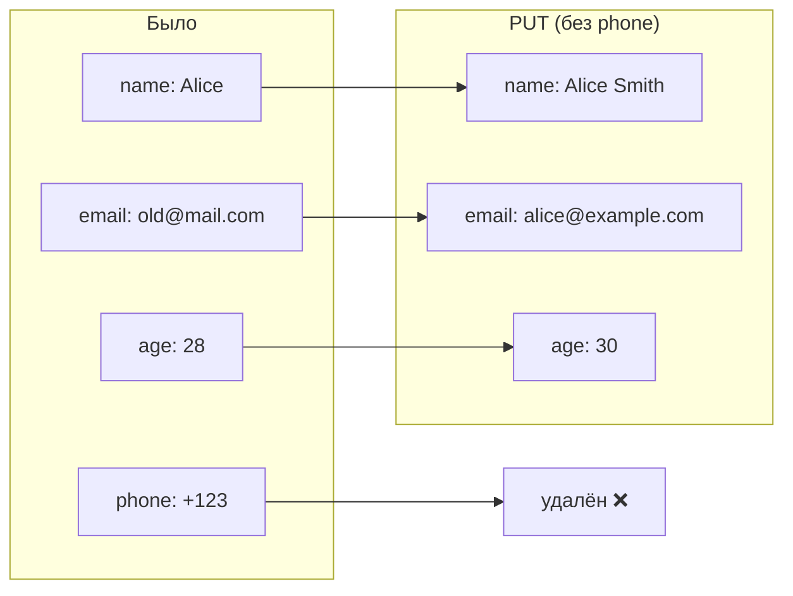

# 🔄 PUT vs PATCH: идемпотентность HTTP-методов

> [!tip] Связь с предыдущей заметкой
> Продолжаем изучать HTTP-методы. Ранее разобрали [[HTTP-методы: GET vs POST — безопасность и когда использовать|GET vs POST]]. Теперь углубляемся в PUT, PATCH и концепцию идемпотентности.

---

## 🧠 Ментальная модель

| Метод | Образ | Что делает |
|-------|-------|-----------|
| **PUT** | 📄 Полная замена документа | Вынимает старый документ, кладёт новый |
| **PATCH** | ✏️ Исправление помарок | Меняет только указанные места |

---

## 🎯 Ключевое отличие

> [!important] PUT vs PATCH
> **PUT заменяет ресурс целиком (идемпотентный), PATCH применяет частичные изменения (идемпотентность — опционально).**

---

## 🔄 Идемпотентность: разбор концепции

### Определение
**Идемпотентность** — свойство операции, при котором повторный вызов с теми же параметрами даёт **тот же результат**, что и первый вызов.

### Простые примеры

| Операция | 1-й вызов | 2-й вызов | Идемпотентна? |
|----------|----------|----------|--------------|
| `x = 5` | x = 5 | x = 5 | ✅ |
| `x = x + 1` | x = 1 | x = 2 | ❌ |
| `DELETE /user/123` | удалён | уже удалён | ✅* |

> [!note] *DELETE идемпотентен — конечное состояние одинаково, хотя статус может отличаться (200 vs 404).

---

## 📊 PUT vs PATCH: техническое сравнение

### PUT — полная замена

```http
PUT /users/123 HTTP/1.1
Content-Type: application/json

{
  "name": "Alice Smith",
  "email": "alice@example.com",
  "age": 30
}
```

**Поведение:**

- Весь ресурс заменяется тем, что в теле
    
- Неуказанные поля — **удаляются**

## 📋 Сравнительная таблица

|Характеристика|**PUT**|**PATCH**|
|---|---|---|
|**Действие**|Полная замена|Частичное обновление|
|**Идемпотентность**|✅ Всегда|⚠️ Зависит от реализации|
|**Неуказанные поля**|Удаляются|Сохраняются|
|**Размер запроса**|Большой (весь ресурс)|Маленький (только изменения)|
|**Риск случайного удаления**|Высокий|Низкий|
|**Стандарт**|RFC 7231|RFC 5789|

---

## 📝 Виды PATCH

### 1. JSON Merge Patch (RFC 7396)


```http

PATCH /users/123
Content-Type: application/merge-patch+json
{
  "age": 31,
  "email": null      // null = удалить поле
}
```
**Правила:**

- Отсутствующие поля → не меняются
    
- `null` → удалить поле
    

### 2. JSON Patch (RFC 6902)


```http

PATCH /users/123
Content-Type: application/json-patch+json
[
  { "op": "replace", "path": "/age", "value": 31 },
  { "op": "add", "path": "/tags/-", "value": "vip" },
  { "op": "remove", "path": "/phone" },
  { "op": "copy", "from": "/address", "path": "/shipping_address" }
]
```
**Операции:**

|Operation|Описание|
|---|---|
|`add`|Добавить поле или элемент в массив|
|`remove`|Удалить поле или элемент|
|`replace`|Заменить значение|
|`copy`|Скопировать с другого пути|
|`move`|Переместить|
|`test`|Проверить значение (атомарность)|

---

## 🔄 Идемпотентность на примерах

### PUT — всегда идемпотентен

```http

PUT /users/123
{"name": "Alice", "age": 30}
```
|Вызов|Состояние|
|---|---|
|1|name="Alice", age=30|
|2|name="Alice", age=30 (то же самое)|
|n|всё ещё то же самое|

**✅ Идемпотентен**

### PATCH — может быть идемпотентным или нет

#### ✅ Идемпотентный PATCH

```http

PATCH /users/123
{"age": 31}
```
Повтор → возраст всё ещё 31

#### ❌ НЕидемпотентный PATCH

```http

PATCH /counter/123
{"op": "increment", "value": 1}
```
Повтор → счётчик увеличивается снова

---

## 📊 Полная таблица HTTP-методов

|Метод|Идемпотентный|Безопасный|Типичное использование|
|---|---|---|---|
|**GET**|✅|✅|Получение данных|
|**POST**|❌|❌|Создание ресурса|
|**PUT**|✅|❌|Полная замена|
|**PATCH**|⚠️|❌|Частичное обновление|
|**DELETE**|✅*|❌|Удаление ресурса|
|**HEAD**|✅|✅|Получение заголовков|
|**OPTIONS**|✅|✅|Проверка возможностей|

> [!note] *DELETE идемпотентен — после удаления повторные вызовы не меняют состояние.

---

## 🧠 Higher-order thinking: когда что использовать

### POST vs PUT для создания

|Сценарий|POST|PUT|
|---|---|---|
|ID назначает сервер|✅ `POST /users`|❌|
|ID известен клиенту|❌|✅ `PUT /users/123`|
|Не знаю, существует ли|✅ создаст новый|⚠️ создаст или заменит|

### PUT vs PATCH для обновления

|Сценарий|PUT|PATCH|
|---|---|---|
|Обновляю **все** поля|✅|⚠️ (избыточно)|
|Обновляю **одно** поле|❌ (надо всё передавать)|✅|
|Не хочу случайно удалить поля|❌|✅|
|Нужна атомарность сложных операций|❌|✅ (JSON Patch)|
|Нужна гарантированная идемпотентность|✅|⚠️ (требует careful design)|

---

## 🔍 Практические примеры

### Пример 1: Обновление профиля пользователя

```http

// ❌ PUT — риск потерять поля
PUT /users/123
{
  "name": "Alice"  // email, age, phone пропадут!
}
// ✅ PATCH — безопасно
PATCH /users/123
{
  "name": "Alice"  // только name меняется
}
```
### Пример 2: Обновление счётчика

```http

// ❌ PUT — не подходит для инкремента
PUT /counter/123
{
  "value": 10  // нужно знать текущее значение!
}
// ✅ PATCH — идеально для операций
PATCH /counter/123
Content-Type: application/json-patch+json
[
  { "op": "add", "path": "/value", "value": 1 }
]
```
### Пример 3: Создание с известным ID

```http

// ✅ PUT — идемпотентное создание
PUT /users/123
{
  "name": "Alice",
  "email": "alice@example.com"
}
// Если пользователя нет — создаётся
// Если есть — заменяется
```
---

## 📌 Вопросы для самопроверки

- Объяснить разницу между PUT и PATCH на аналогии с документом
    
- Что такое идемпотентность и почему она важна?
    
- Какие HTTP-методы являются идемпотентными?
    
- Почему PUT идемпотентен, а POST — нет?
    
- В чём разница между JSON Merge Patch и JSON Patch?
    
- Когда использовать PUT вместо PATCH?
    
- Может ли PATCH быть идемпотентным? Приведите примеры.
    
- Что произойдёт, если отправить PUT с неполными данными?
    

---

## 🔗 Связанные заметки

- [[HTTP-методы: GET vs POST — безопасность и когда использовать]]
    
- [[REST API: принципы проектирования ресурсов]]
    
- [[Идемпотентность в API: почему это важно]]
    
- [[HTTP-статусы: 200, 400, 401, 403, 404, 500]]
    

---

## ✅ Чек-лист усвоения темы

- Могу объяснить разницу между PUT и PATCH
    
- Понимаю концепцию идемпотентности
    
- Знаю, какие методы идемпотентны, а какие — нет
    
- Могу выбрать между PUT и PATCH для разных сценариев
    
- Знаю форматы JSON Merge Patch и JSON Patch
    
- Понимаю, почему PUT подходит для идемпотентного создания
    
- Могу спроектировать API с правильным использованием методов