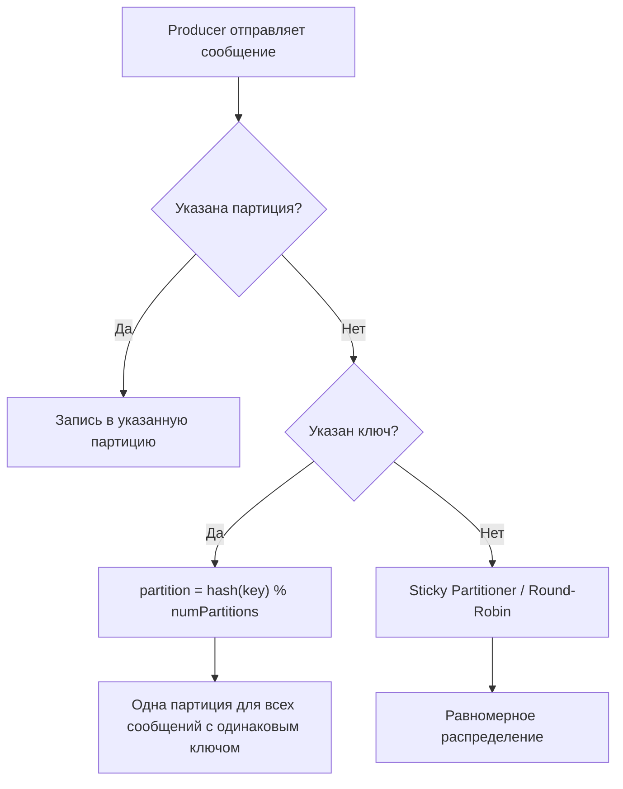
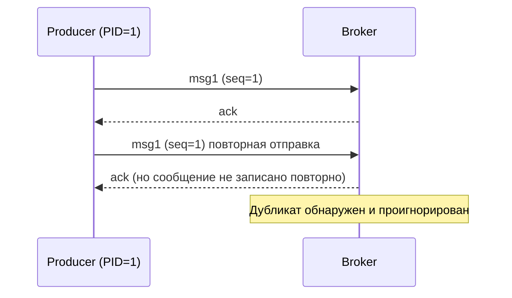

# 🎯 Kafka: как распределяются сообщения по партициям и гарантии доставки

> [!tip] Связь с предыдущей заметкой
> Это продолжение [[Apache Kafka — основные концепции]]. Теперь углубляемся в Producer и гарантии.

---

## 📮 Ментальная модель (продолжение почтовой аналогии)

| Компонент | Почтовый образ |
|-----------|---------------|
| **Producer** | Отправитель, который приносит письма |
| **Key** | Идентификатор клиента (например, номер договора) |
| **Partitioner** | Сотрудник почты, который решает, в какой ящик бросить письмо |
| **acks** | Требование расписаться в получении |
| **Idempotence** | Защита от дублей: если письмо с таким же номером уже есть — его игнорируют |

---

## 🔀 Распределение сообщений по партициям

### 3 способа определения партиции


### Sticky Partitioner (рекомендуемый)

- **Принцип:** накапливает сообщения в батч, отправляет в одну партицию
    
- **Зачем:** снижает количество сетевых запросов, улучшает сжатие
    
- **Почему лучше Round-Robin:** меньше overhead, выше throughput
    


```java

// Настройка производителя (Java)
Properties props = new Properties();
props.put("bootstrap.servers", "localhost:9092");
props.put("partitioner.class", "org.apache.kafka.clients.producer.internals.StickyPartitioner");
```
> [!warning] Важно  
> Если ключ **не указан**, порядок сообщений **не гарантируется**.  
> Если ключ **указан**, порядок **гарантируется** внутри одной партиции для этого ключа.

---

## ✅ Гарантии доставки (Delivery Guarantees)

### Уровни acks (подтверждения от брокера)

|acks|Поведение|Потеря данных|Производительность|
|---|---|---|---|
|`0`|Producer не ждёт подтверждения|✅ возможна|🔥 максимальная|
|`1`|Ждёт подтверждения от лидера|⚠️ при падении лидера|🟢 высокая|
|`all` или `-1`|Ждёт подтверждения от всех ISR|❌ минимальная|🐢 снижена|

### ISR (In-Sync Replicas)

- Реплики, которые **успели синхронизироваться** с лидером
    
- Если реплика отстаёт → исключается из ISR
    
- `acks=all` ждёт подтверждения **только от ISR**
    

---

## 🔐 Exactly-once семантика

### 1. Идемпотентность (producer-side exactly-once)


```java

props.put("enable.idempotence", "true");
props.put("acks", "all"); // обязательно
```
**Как работает:**

- Producer получает **Producer ID (PID)**
    
- Каждое сообщение получает **sequence number**
    
- Брокер проверяет дубли по (PID, sequence number)



### 2. Транзакции (end-to-end exactly-once)

Позволяют атомарно писать в **несколько партиций** и координировать с consumer.

```java

producer.initTransactions();
producer.beginTransaction();
try {
    producer.send(record1);
    producer.send(record2);
    producer.commitTransaction();
} catch (Exception e) {
    producer.abortTransaction();
}
```
**Consumer с изоляцией:** `isolation.level=read_committed` (не видит незакоммиченные сообщения)

---

## 🧠 Higher-order thinking: вопросы для анализа

### ❓ Когда использовать acks=0?

- Логи, метрики, трассировка
    
- Потеря одного события не критична
    
- Требуется максимальная скорость
    

### ❓ Когда использовать acks=all + идемпотентность?

- Платёжные системы
    
- Инкрементальные счётчики (нельзя потерять)
    
- Любые данные, где важна consistency
    

### ❓ В чём разница между идемпотентностью и транзакциями?

- **Идемпотентность:** защищает от дублей **в рамках одного producer** при повторных отправках
    
- **Транзакции:** позволяют атомарно писать в **несколько партиций** и синхронизировать **consumer + producer**
    

---

## 📋 Сравнение гарантий доставки

|Режим|Потеря|Дубли|Порядок|Производительность|
|---|---|---|---|---|
|acks=0|✅ возможна|✅ возможны|✅ (внутри партиции)|🔥🔥🔥|
|acks=1|⚠️ возможна (падение лидера)|✅ возможны|✅|🔥🔥|
|acks=all|❌ минимальна|✅ возможны|✅|🔥|
|acks=all + idempotence|❌ минимальна|❌ нет|✅|🔥|
|acks=all + transactions|❌ минимальна|❌ нет|✅|🔥 (с overhead)|

---

## 📌 Вопросы для самопроверки

- Объяснить, как работает Sticky Partitioner и почему он лучше Round-Robin
    
- Какие есть способы задать партицию для сообщения?
    
- Что будет, если указать ключ, но количество партиций изменится?
    
- В чём разница между acks=1 и acks=all?
    
- Что такое ISR и почему они важны для acks=all?
    
- Как идемпотентность предотвращает дубли?
    
- Когда нужны транзакции, а когда достаточно идемпотентности?
    
- Что произойдёт с consumer, который читает незакоммиченные транзакции?
    

---

## 🔧 Практические настройки (пример)


```properties

# Producer config
bootstrap.servers=kafka1:9092,kafka2:9092
acks=all
enable.idempotence=true
max.in.flight.requests.per.connection=5   # для идемпотентности <=5
retries=2147483647                        # бесконечные ретраи
compression.type=snappy
batch.size=16384
linger.ms=10
```


```properties

# Consumer config (для exactly-once)
enable.auto.commit=false
isolation.level=read_committed
```
---


    

---

## ✅ Чек-лист усвоения темы

- Могу объяснить 3 способа распределения по партициям
    
- Понимаю разницу между acks=0, 1, all
    
- Знаю, что такое ISR и зачем они
    
- Могу объяснить, как работает идемпотентность
    
- Понимаю, когда нужны транзакции
    
- Могу выбрать правильные гарантии для разных сценариев
    

