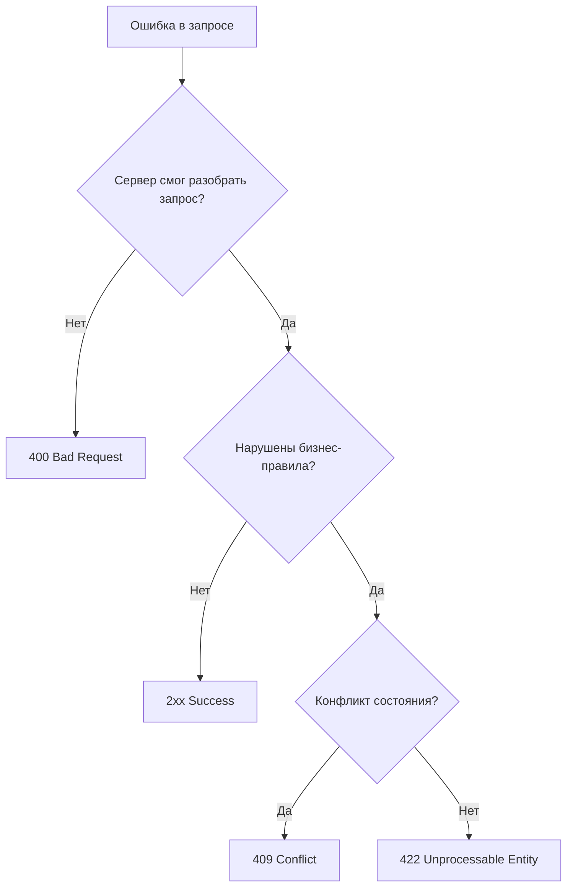

# 🚦 HTTP-статусы: 400, 422, 409 — валидация и бизнес-конфликты

> [!tip] Связь с предыдущими заметками
> - [[HTTP-методы: GET vs POST — безопасность и когда использовать]]
> - [[PUT vs PATCH — идемпотентность HTTP-методов]]

---

## 🧠 Ментальная модель: разговор с сотрудником

| Статус | Образ | Что значит |
|--------|-------|------------|
| **400** | 📄 "Я не понимаю этот язык" | Синтаксическая ошибка — запрос не разобран |
| **422** | 📋 "Я понимаю, но так нельзя" | Бизнес-правила нарушены, формат корректен |
| **409** | ⚔️ "Сейчас это невозможно" | Конфликт с текущим состоянием ресурса |

> [!important] Ключевое отличие
> **400 — ошибка формата, 422 — ошибка бизнес-логики при корректном формате, 409 — конфликт состояния ресурса.**

---

## 📊 Сравнительная таблица

| Характеристика | **400 Bad Request** | **422 Unprocessable Entity** | **409 Conflict** |
|----------------|---------------------|------------------------------|------------------|
| **Запрос разобран?** | ❌ Нет | ✅ Да | ✅ Да |
| **Синтаксис корректен?** | ❌ Нет | ✅ Да | ✅ Да |
| **Бизнес-логика проверена?** | ❌ Нет | ❌ Нарушена | ⚠️ Конфликт |
| **Когда использовать** | Невалидный JSON, wrong type, missing required | Бизнес-правила, валидация полей | Optimistic lock, duplicate, state conflict |
| **Retry logic** | ❌ Бесполезно | ❌ Бесполезно | ✅ Возможно |

---

## 🔴 400 Bad Request — синтаксическая ошибка

### Когда возвращать

**Сервер не может понять запрос из-за синтаксиса или формата.**

```http
// ❌ Невалидный JSON
POST /users HTTP/1.1
Content-Type: application/json

{"name": "Alice", "age": 30   // закрывающая скобка пропущена
```

```http

// ❌ Неверный тип данных
POST /users HTTP/1.1
Content-Type: application/json
{
  "name": "Alice",
  "age": "тридцать"     // ожидается number
}
```

```http

// ❌ Отсутствует обязательное поле
POST /users HTTP/1.1
Content-Type: application/json
{
  "name": "Alice"
  // email обязателен, но отсутствует
}
```

```http

// ❌ Неподдерживаемый Content-Type
POST /users HTTP/1.1
Content-Type: text/plain
name=Alice&age=30      // API ждёт JSON
```
### Ответ

```http

HTTP/1.1 400 Bad Request
Content-Type: application/problem+json
{
  "type": "https://api.example.com/errors/invalid-json",
  "title": "Invalid request body",
  "status": 400,
  "detail": "Expected JSON, got plain text at line 1",
  "instance": "/users"
}
```
---

## 🟡 422 Unprocessable Entity — бизнес-ошибка

### Когда возвращать

**Запрос корректен по формату, но не проходит бизнес-валидацию.**

```http

// ❌ Бизнес-правило: возраст >= 18
POST /users HTTP/1.1
Content-Type: application/json
{
  "name": "Alice",
  "email": "alice@example.com",
  "age": 16
}
```

```http

// ❌ Логическая ошибка: отрицательное количество
POST /orders HTTP/1.1
Content-Type: application/json
{
  "productId": 123,
  "quantity": -5
}
```

```http

// ❌ Валидация формата email
POST /users HTTP/1.1
Content-Type: application/json
{
  "name": "Bob",
  "email": "not-an-email"
}
```
### Ответ

```http

HTTP/1.1 422 Unprocessable Entity
Content-Type: application/problem+json
{
  "type": "https://api.example.com/errors/validation-failed",
  "title": "Validation error",
  "status": 422,
  "detail": "Request validation failed",
  "errors": {
    "age": ["Age must be at least 18"],
    "email": ["Must be a valid email address"]
  }
}
```
---

## 🔵 409 Conflict — конфликт состояния

### Когда возвращать

**Операция конфликтует с текущим состоянием ресурса.**

```http

// ❌ Оптимистичная блокировка
PUT /users/123 HTTP/1.1
If-Match: "etag-12345"
Content-Type: application/json
{
  "name": "Alice Updated",
  "version": 1
}
// Другой запрос уже изменил ресурс → версия не совпадает
```

```http

// ❌ Попытка создать существующий ресурс (с известным ID)
PUT /users/alice@example.com HTTP/1.1
Content-Type: application/json
{
  "name": "Alice"
}
// Пользователь с таким ID уже существует
```


```http

// ❌ Состояние ресурса не позволяет операцию
POST /orders/123/cancel HTTP/1.1
Content-Type: application/json
{
  "reason": "change mind"
}
// Заказ уже доставлен — нельзя отменить
```
### Ответ

```http

HTTP/1.1 409 Conflict
Content-Type: application/problem+json
{
  "type": "https://api.example.com/errors/conflict",
  "title": "Resource conflict",
  "status": 409,
  "detail": "The resource has been modified by another user",
  "instance": "/users/123"
}
```
---

## 🧩 Decision Tree


## 🤔 Сложные случаи

### 1. Email уже существует — 422 или 409?

|Подход|Аргументация|
|---|---|
|**422**|Бизнес-правило уникальности нарушено. Формат корректен, данные не проходят валидацию.|
|**409**|Ресурс с таким email уже существует — конфликт идентификатора.|

**Рекомендация:**

- **POST /users** (создание) → **422** (business validation)
    
- **PUT /users/{email}** (идемпотентное создание) → **409** (resource already exists)
    

### 2. Оптимистичная блокировка — 409 или 412?

- **409 Conflict** — когда конфликт состояния (версия изменилась)
    
- **412 Precondition Failed** — когда условие `If-Match` не выполнено (RFC 7232)
    

**Рекомендация:** оба допустимы, но **409** более интуитивен для API.

### 3. Неверный формат email — 400 или 422?

- **400** — если email отсутствует или тип не string
    
- **422** — если email есть, тип string, но не соответствует формату
    

---

## 📋 Лучшие практики

### Используйте RFC 7807 (Problem Details)

```http

HTTP/1.1 422 Unprocessable Entity
Content-Type: application/problem+json
{
  "type": "https://api.example.com/errors/validation-error",
  "title": "Validation Failed",
  "status": 422,
  "detail": "The request contains invalid data",
  "instance": "/users",
  "errors": {
    "email": ["must be a valid email address"],
    "age": ["must be at least 18"]
  }
}
```
### Структурированные ошибки валидации


```json

{
  "status": 422,
  "code": "VALIDATION_ERROR",
  "message": "Request validation failed",
  "fields": [
    {
      "field": "email",
      "code": "INVALID_FORMAT",
      "message": "Must be a valid email address"
    },
    {
      "field": "age",
      "code": "MINIMUM_VALUE",
      "message": "Must be at least 18",
      "constraints": { "min": 18, "actual": 16 }
    }
  ]
}
```
### Retry политики

|Статус|Повтор?|Как повторить|
|---|---|---|
|**400**|❌ Нет|Исправить запрос|
|**422**|❌ Нет|Исправить данные|
|**409**|✅ Да|Получить актуальное состояние, повторить|

---

## 📊 Полная карта клиентских ошибок (4xx)

|Статус|Название|Когда использовать|
|---|---|---|
|**400**|Bad Request|Невалидный синтаксис, неверный формат|
|**401**|Unauthorized|Нет аутентификации|
|**403**|Forbidden|Есть аутентификация, но нет прав|
|**404**|Not Found|Ресурс не найден|
|**409**|Conflict|Конфликт состояния (optimistic lock, duplicate)|
|**422**|Unprocessable Entity|Бизнес-валидация не пройдена|
|**429**|Too Many Requests|Rate limiting|

---

## 📌 Вопросы для самопроверки

- Объяснить разницу между 400, 422 и 409 на примерах
    
- В каком случае вернуть 400 вместо 422?
    
- Когда email already exists — это 422, а когда 409?
    
- Что такое optimistic lock и почему для него возвращают 409?
    
- Можно ли повторить запрос после 409? А после 400?
    
- Что такое `application/problem+json` и зачем он нужен?
    
- Как структурировать ответ с несколькими ошибками валидации?