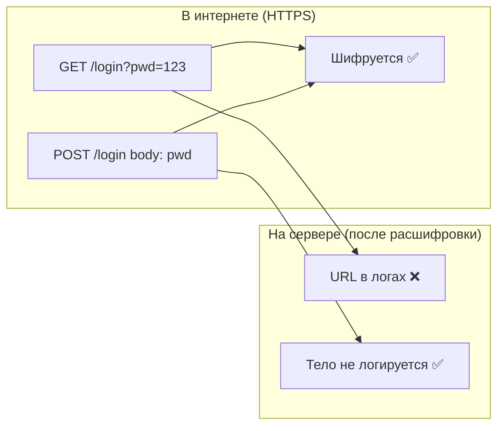

---
title: HTTP-методы: GET vs POST — безопасность и когда использовать
tags: [http, rest, api-design, security, web-development]
date: 2026-03-26
---

# 🌐 HTTP-методы: GET vs POST

> [!tip] Зачем это знать
> Понимание различий между GET и POST — основа безопасной и корректной разработки API. Неправильный выбор может привести к утечке данных или нарушению REST-принципов.

---

## 🧠 Ментальная модель: открытка vs запечатанное письмо

| | **GET** | **POST** |
|---|---|---|
| **Образ** | 📮 Открытка | ✉️ Запечатанное письмо |
| **Где данные** | На обложке (URL) | Внутри конверта (body) |
| **Кто видит** | Все, кто видит письмо | Только адресат |
| **Размер** | Ограничен | Не ограничен |
| **Повторное использование** | Можно копировать | Нужно отправлять заново |

> [!important] Ключевое отличие
> **GET передаёт данные в URL (видно всем), POST — в теле запроса (не видно в логах и истории).**

---

## 📊 Сравнительная таблица

| Характеристика | **GET** | **POST** |
|----------------|--------|---------|
| **Место данных** | URL (query string) | Тело запроса (body) |
| **Ограничение длины** | ~2048 символов | Практически нет |
| **Кэширование** | ✅ Да (браузер, CDN, прокси) | ❌ Нет (по умолчанию) |
| **История браузера** | ✅ Сохраняется | ❌ Не сохраняется |
| **Закладки** | ✅ Можно сохранить | ❌ Нельзя |
| **Идемпотентность** | ✅ Да | ❌ Нет |
| **Безопасность** | ❌ Низкая | ✅ Высокая |
| **Типичное использование** | Получение, поиск | Создание, чувствительные данные |

---

## 🔐 Почему чувствительные данные нужно передавать через POST

### 1. История браузера
```http
GET /login?password=Secret123
```

❌ Пароль сохраняется в истории браузера навсегда.

### 2. Логи сервера

text

192.168.1.1 - - [26/Mar/2026:12:00:00] "GET /login?password=Secret123 HTTP/1.1" 200

❌ Пароль в логах Nginx, Apache, AWS ELB, балансировщиках.

### 3. Referer header

При переходе на другой сайт браузер может отправить Referer:

http

Referer: https://site.com/login?password=Secret123

❌ Чувствительные данные утекают на сторонние ресурсы.

### 4. Кэширование

- Браузер кэширует GET-запросы
    
- Прокси-серверы (корпоративные, ISP) кэшируют
    
- CDN (CloudFlare, Fastly) кэшируют
    

❌ Пароль может оказаться на чужих серверах.

### 5. Скриншоты и screen sharing

❌ Пароль виден в адресной строке при скриншотах, демонстрации экрана, поддержке.

---

## ✅ Как POST решает эти проблемы

http

POST /login HTTP/1.1
Host: example.com
Content-Type: application/json
{
  "username": "alice",
  "password": "Secret123"
}

|Угроза|GET|POST|
|---|---|---|
|История браузера|❌|✅|
|Логи сервера|❌ (URL логируется)|✅ (тело по умолчанию нет)|
|Referer|❌|✅|
|Кэширование|❌|✅|
|Скриншоты|❌|✅|

> [!warning] Важно  
> POST-тело **может** логироваться, если специально настроить логирование тела запроса. GET логируется **всегда** без дополнительных настроек.

---

## 🔄 Идемпотентность и безопасность методов

### Определения

- **Идемпотентность:** повторный запрос даёт тот же результат
    
- **Безопасность:** метод не изменяет состояние сервера
    

### Таблица REST-методов

|Метод|Идемпотентный|Безопасный|Типичное использование|
|---|---|---|---|
|**GET**|✅|✅|Получение данных|
|**POST**|❌|❌|Создание ресурса|
|**PUT**|✅|❌|Полная замена ресурса|
|**PATCH**|❌|❌|Частичное обновление|
|**DELETE**|✅|❌|Удаление ресурса|

> [!tip] DELETE — идемпотентный, потому что повторное удаление не меняет состояние (ресурс уже удалён).

---

## 🎯 REST-принципы: когда использовать GET vs POST

### GET — для получения данных

http

GET /users/123
GET /products?category=books&page=2
GET /search?q=kafka

**Правила:**

- ✅ Только чтение
    
- ✅ Параметры — фильтрация, поиск, пагинация
    
- ✅ Не изменяет состояние
    
- ❌ **Никогда** не передавать чувствительные данные
    

### POST — для создания и сложных операций

http

POST /users
{
  "name": "Alice",
  "email": "alice@example.com"
}
POST /orders/123/payments
{
  "amount": 100,
  "card": "****-****-****-1234"
}

**Правила:**

- ✅ Создание новых ресурсов
    
- ✅ Передача больших данных
    
- ✅ Чувствительные данные
    
- ✅ Сложные операции (GraphQL, поиск с большим фильтром)
    

---

## 🤔 Частые вопросы и заблуждения

### ❓ "POST безопаснее, потому что HTTPS шифрует POST, но не GET?"

**Нет!** HTTPS шифрует **весь трафик** — и GET, и POST.

Разница не в шифровании, а в том, **где находятся данные** после расшифровки на сервере:

- GET: данные в URL → попадают в логи, историю, referer
    
- POST: данные в теле → не попадают в стандартные логи


### ❓ "Можно ли использовать GET для пароля, если очень хочется?"

**Никогда.** Даже если:

- У вас HTTPS
    
- Вы не логируете URL
    
- Вы очищаете историю
    

**Риски:**

- Прокси-серверы и CDN кэшируют
    
- Корпоративные firewall логируют
    
- Браузерные расширения имеют доступ к URL
    
- Пользователь может скопировать URL и отправить кому-то
    
- Браузер сохраняет в истории даже при приватном режиме (в некоторых реализациях)
    

### ❓ "А что насчёт PUT и PATCH?"

|Метод|Когда использовать|
|---|---|
|**PUT**|Полная замена ресурса (идемпотентный) — `PUT /users/123`|
|**PATCH**|Частичное обновление (не идемпотентный) — `PATCH /users/123`|
|**POST**|Создание (сервер назначает ID) — `POST /users`|

---

## 📋 Decision Matrix: GET or POST?

|Сценарий|GET|POST|
|---|---|---|
|Получение списка товаров|✅|❌|
|Поиск с маленькими параметрами|✅|❌|
|Поиск с большим фильтром (>2KB)|❌|✅|
|Форма логина (пароль)|❌|✅|
|Загрузка файла|❌|✅|
|Создание пользователя|❌|✅|
|Параметры, которые должны быть в закладках|✅|❌|
|GraphQL запрос|❌ (может быть слишком длинным)|✅|
|Данные, которые не должны кэшироваться|❌|✅|

---

## 📌 Вопросы для самопроверки

- Объяснить разницу между GET и POST на аналогии с открыткой и письмом
    
- Почему пароль нельзя передавать через GET, даже если используется HTTPS?
    
- Какие 5 мест, где может оказаться пароль, переданный через GET?
    
- Что такое идемпотентность и почему это важно?
    
- Какие методы HTTP являются идемпотентными, а какие — нет?
    
- В каком сценарии POST может быть предпочтительнее GET даже для получения данных?
    
- Что такое referer header и почему он опасен для GET?