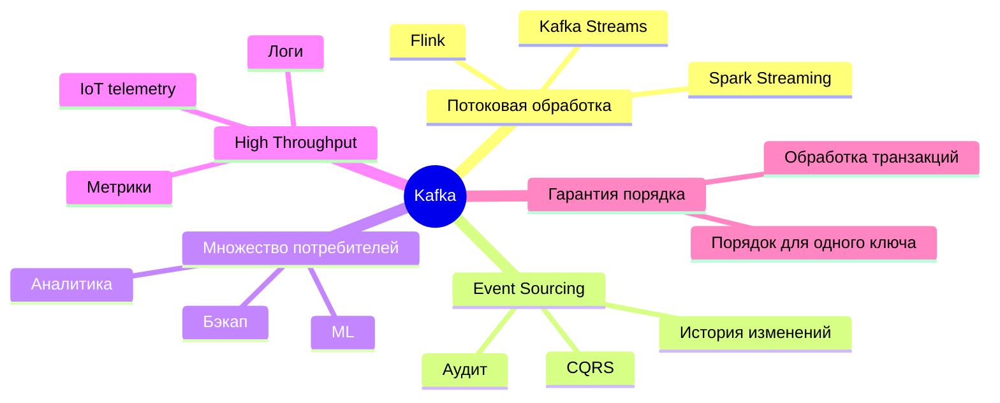
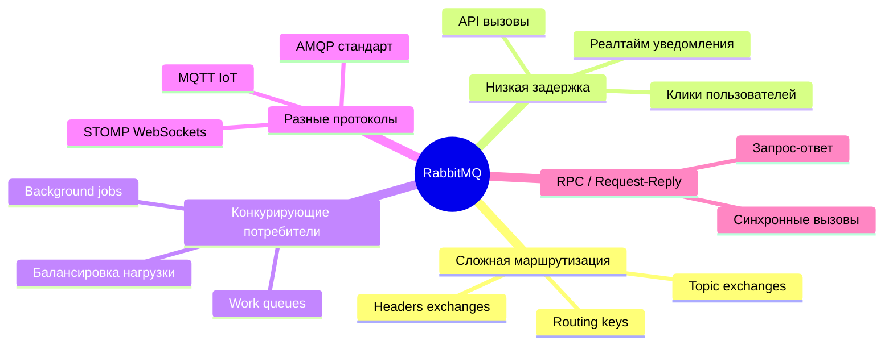
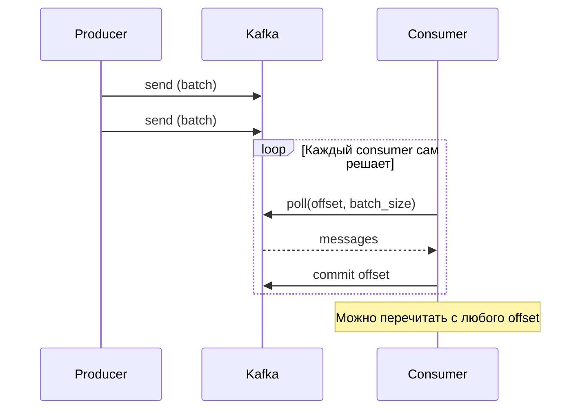
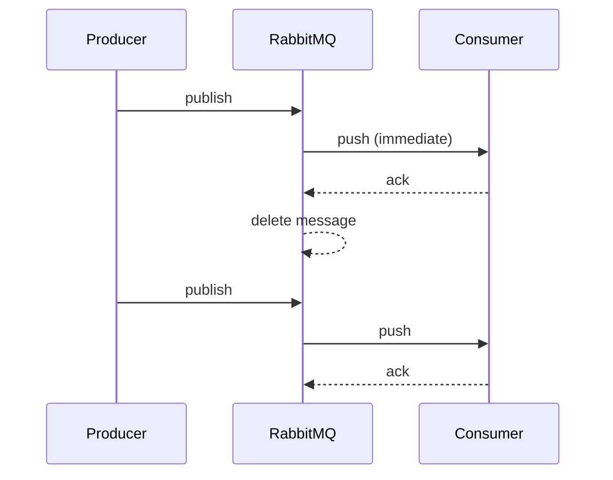
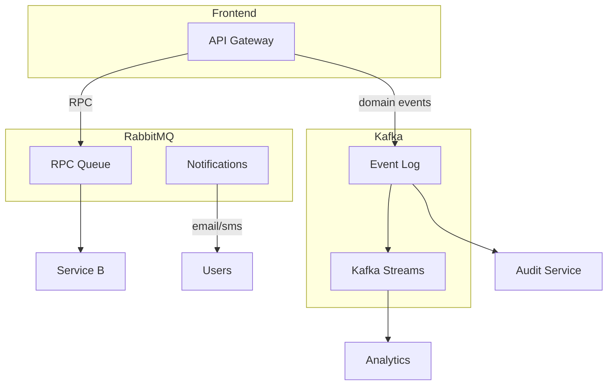

# ⚖️ Kafka vs RabbitMQ/ActiveMQ: когда что использовать

> [!tip] Связь с предыдущими заметками
> - [[Apache Kafka — основные концепции]]
> - [[Kafka — распределение по партициям и гарантии доставки]]

---

## 🧠 Ментальная модель: два разных подхода

| Характеристика | **Kafka (Amazon-склад)** | **RabbitMQ (Курьерская служба)** |
|----------------|-------------------------|--------------------------------|
| **Что делает** | Хранит **все** заказы в хронологическом порядке | Получает посылку и **сразу** пытается доставить |
| **Удаление** | По времени/размеру (retention) | После подтверждения получения (ack) |
| **Кто читает** | Много отделов (каждый со своей скоростью) | Один курьер из группы забирает посылку |
| **Повторное чтение** | ✅ Да (можно перемотать время) | ❌ Нет (посылка удалена) |

> [!important] Ключевое отличие
> **Kafka — распределённый лог (журнал), RabbitMQ — очередь сообщений с умной маршрутизацией.**

---

## 📊 Сравнительная таблица

| Характеристика | **Kafka** | **RabbitMQ / ActiveMQ** |
|----------------|-----------|------------------------|
| **Модель** | Распределённый лог | Очередь / Topic (AMQP) |
| **Хранение** | Долгое (дни–недели), на диске | Короткое (обычно в RAM до обработки) |
| **Удаление** | Retention (время/размер) | После ack |
| **Повторное чтение** | ✅ Да (offset) | ❌ Нет |
| **Порядок** | Гарантирован внутри партиции | Не гарантирован (кроме отдельных очередей) |
| **Масштабирование** | Линейное (партиции) | Ограниченное |
| **Маршрутизация** | Простая (топик → партиции) | Сложная (exchanges, bindings) |
| **Производительность** | 🔥🔥🔥 100k+ msg/sec | 🔥🔥 10–50k msg/sec |
| **Задержка** | >10 мс (батчи) | <1 мс (push) |
| **Протоколы** | Kafka Protocol | AMQP, MQTT, STOMP, HTTP |
| **Pull/Push** | Pull (consumer тянет) | Push (брокер толкает) |

---

## ✅ Kafka: когда использовать

### Конкретные сценарии

- **Потоковая аналитика в реальном времени**
    
- **Журнал аудита** (нужно хранить историю)
    
- **Data pipeline** между микросервисами
    
- **Логи и метрики** (миллионы событий)
    
- **Event-driven architecture** с replay возможностью
    

---

## 📬 RabbitMQ / ActiveMQ: когда использовать

### Конкретные сценарии

- **Система уведомлений** (email, sms, push — разные правила)
    
- **Task queues** (обработка изображений, отправка писем)
    
- **RPC между микросервисами**
    
- **IoT-устройства** (MQTT)
    
- **WebSocket-уведомления** (STOMP)
    

---

## 🎭 Архитектурные различия

### Kafka: Pull-based

**Плюсы:** контроль над скоростью, возможность батчирования, replay  
**Минусы:** выше задержка, сложнее с backpressure

### RabbitMQ: Push-based

**Плюсы:** низкая задержка, простота  
**Минусы:** риск перегрузить consumer, нет replay

---

## 🔀 Гибридные архитектуры

Часто используют **оба брокера** в одной системе:

## 🧠 Higher-order thinking: вопросы для выбора

### ❓ Задайте себе эти вопросы:

1. **Нужно ли перечитывать историю?**
    
    - Да → **Kafka**
        
    - Нет → RabbitMQ
        
2. **Сколько потребителей у одного сообщения?**
    
    - Один → RabbitMQ (competing consumers)
        
    - Много (разные сервисы) → **Kafka**
        
3. **Какая задержка допустима?**
    
    - <10 мс → RabbitMQ
        
    - > 10 мс, важен throughput → **Kafka**
        
4. **Нужна сложная маршрутизация?**
    
    - Да (exchanges, routing keys) → RabbitMQ
        
    - Нет (просто топики) → **Kafka**
        
5. **Какие протоколы нужны?**
    
    - MQTT, AMQP, STOMP → RabbitMQ
        
    - Только Kafka Protocol → **Kafka**
        
6. **Какой объём данных?**
    
    - Миллионы/сек → **Kafka**
        
    - Тысячи/сек → RabbitMQ
        

---

## 📊 Decision Matrix

|Критерий|Kafka|RabbitMQ|
|---|---|---|
|Replay / перечитывание|✅ ✅ ✅|❌|
|Multiple consumers|✅ ✅ ✅|⚠️ (каждый свою очередь)|
|Низкая задержка|⚠️|✅ ✅ ✅|
|Сложная маршрутизация|❌|✅ ✅ ✅|
|High throughput|✅ ✅ ✅|⚠️|
|Простота настройки|⚠️ (ZooKeeper/KRaft)|✅ ✅ ✅|
|Разные протоколы|❌|✅ ✅ ✅|
|Гарантия порядка|✅ ✅ ✅|⚠️|

---

## 📌 Вопросы для самопроверки

- Объяснить разницу между логом (Kafka) и очередью (RabbitMQ) на аналогии
    
- Когда я выберу Kafka, а когда RabbitMQ для нового проекта?
    
- Почему Kafka не подходит для RPC?
    
- Почему RabbitMQ не подходит для event sourcing?
    
- Что такое competing consumers и где это используется?
    
- Можно ли использовать Kafka для задач с низкой задержкой?
    
- Какую архитектуру вы предложите, если нужны и высокая пропускная способность, и сложная маршрутизация?
    

---

